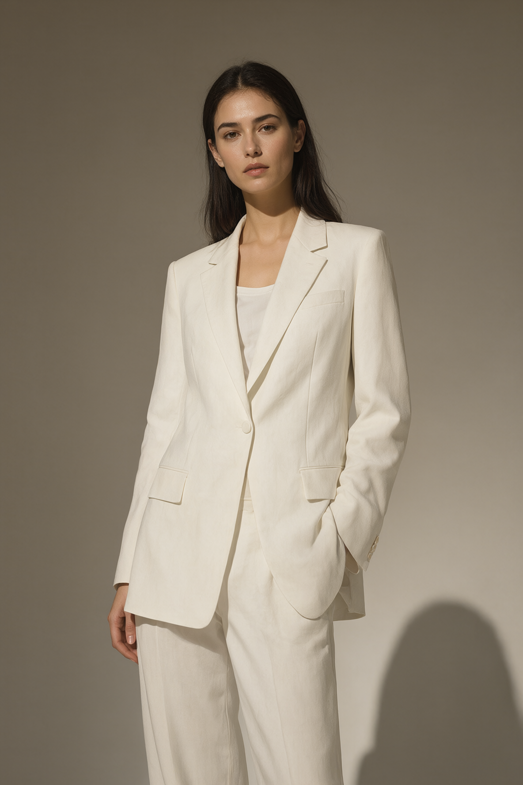
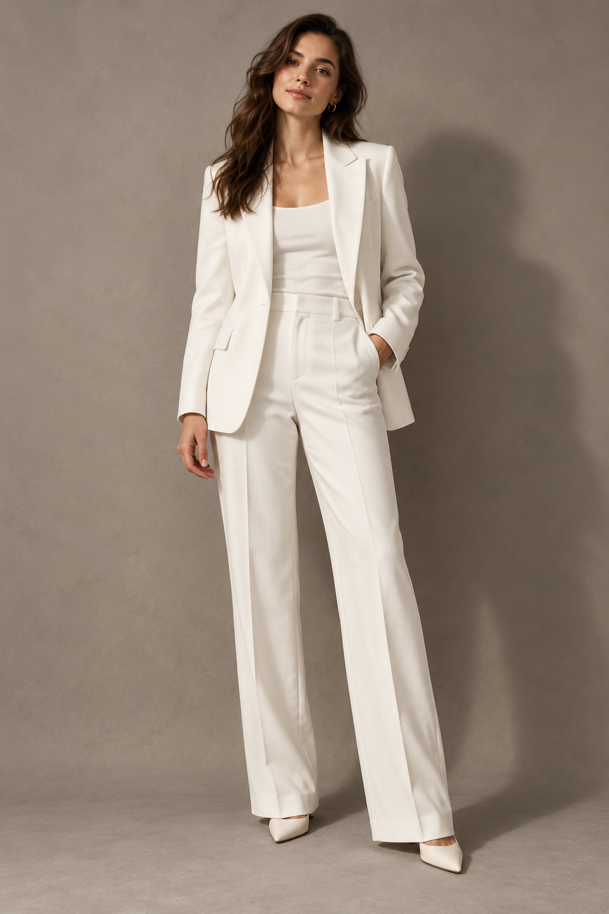

# ComfyUI Image Bench · Qwen 2.1

An ongoing visual comparison of local **Qwen Image 2.1 in ComfyUI** and **ChatGPT Images 2.0 Sol (light)**, as identified by the operator. We run both systems end to end with the same prompt and compare their outputs on text to image (T2I) and image to image (I2I) tasks. The first example below is a visual comparison; measured performance results will follow as run records are completed.

<div class="site-index">
<a href="hardware.html">Benchmark hardware <span>CPU, GPU, memory and driver</span></a>
<a href="software.html">Software setup <span>ComfyUI, Python, PyTorch and models</span></a>
<a href="methodology.html">Method and prompts <span>Workflow sources and reproducibility</span></a>
</div>

## T2I Realistic Character

A fashion editorial portrait tests clothing detail, lighting, composition, and the requested 2:3 aspect ratio. Both images were supplied with the draft on 2026-09-26. No scored winner or timing is assigned to this pair.

### Prompt

ChatGPT was used to generate the prompts used.

```json
{"rewritten_prompt":"A fashion editorial photograph shows a woman in a tailored white suit against a warm gray studio background. She stands facing the camera in a relaxed pose, wearing a white blazer and matching trousers over a simple white top. The suit fabric has a soft matte texture, with crisp lapels and clean seams. Gentle side lighting defines the folds of the clothing and casts a subtle shadow behind her. The composition is elegant and understated.","wh_ratio":"2:3"}
```

### Results

<div class="comparison" aria-label="Realistic character comparison">
<figure>
<a href="assets/images/t2i-realistic-character/qwen-image-2-1/output-001.png"></a>
<figcaption><strong>Qwen Image 2.1</strong><span>Local ComfyUI · INT8 ConvRot · 1184 × 1776</span><a href="assets/images/t2i-realistic-character/qwen-image-2-1/output-001.png" download>Download original PNG</a></figcaption>
</figure>
<figure>
<a href="assets/images/t2i-realistic-character/chatgpt/output-001.png"></a>
<figcaption><strong>ChatGPT Images 2.0 Sol (light)</strong><span>Operator label · 1024 × 1536</span><a href="assets/images/t2i-realistic-character/chatgpt/output-001.png" download>Download original PNG</a></figcaption>
</figure>
</div>

Images are displayed at the same width, retaining their original aspect ratios. Select an image to inspect the original pixels.

### Recorded settings

| Setting | Qwen Image 2.1 | ChatGPT |
| --- | --- | --- |
| Source | Embedded PNG workflow and API graph | Operator-provided PNG and draft |
| Output | 1184 × 1776 PNG | 1024 × 1536 PNG |
| Aspect ratio | 2:3, resolution selector set to 2 MP | 2:3 output |
| Seed | `593103825222985` | Not recorded |
| Steps / CFG | 25 / 1.0 | Not exposed in supplied record |
| Sampler / scheduler | Euler / simple | Not exposed in supplied record |
| Denoise / batch size | 1.0 / 1 | Not recorded |
| Negative prompt | Empty | Not recorded |
| Timing / peak VRAM | Not recorded | Not recorded |

The ChatGPT PNG contains no generation metadata. Its model name and shared prompt are taken from the draft, and cannot be independently verified from the file. The current [host](hardware.html) and [software inventory](software.html) are documented separately; a per-run environment lock and model hashes remain to be captured.

### Reproduction artifacts

Use the [official ComfyUI Qwen Image 2.1 template](https://comfy.org/workflows/bb7e03924a5c-bb7e03924a5c/) as the starting point. The artifacts below were extracted from the supplied Qwen PNG and retain this example’s exact settings:

- [ComfyUI workflow](data/t2i-realistic-character/workflow.json)
- [API workflow](data/t2i-realistic-character/workflow-api.json)
- [Exact submitted prompt](data/t2i-realistic-character/prompt.json)
- [SHA-256 manifest for the images and artifacts](data/t2i-realistic-character/manifest.json)

## I2I comparisons

The local image editing workflow has run with two input images. The first I2I comparison will be added when its input images, prompt, outputs, and run settings are available.
